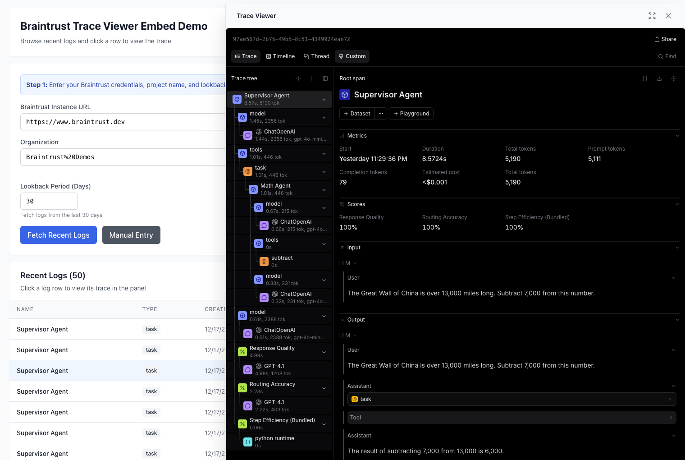

# Braintrust Trace Viewer Embed Demo

A modern React + TypeScript application demonstrating how to embed the Braintrust trace viewer as an iframe in your own application. **Browse logs via the Braintrust API and click to view traces** - no manual ID entry required!



## Features

- **Modern Stack**: React 19 + TypeScript + Vite
- **Tailwind CSS**: Beautiful, responsive UI
- **Environment Variables**: Secure configuration using .env files
- **API-Driven**: Automatically fetches recent logs from Braintrust API
- **Interactive Logs Table**: Browse recent logs and click to view traces
- **iframe Embedding**: Full Braintrust trace viewer embedded in your app
- **API Key Authentication**: Secure authentication via URL parameters
- **TypeScript Types**: Fully typed for better developer experience
- **Reusable Components**: TraceViewer component with ref API for programmatic control

## Tech Stack

- **React 19**: Latest React with hooks
- **TypeScript**: Type-safe development
- **Vite**: Fast build tool and dev server
- **Tailwind CSS**: Utility-first CSS framework
- **pnpm**: Fast, disk-efficient package manager
- **Braintrust BTQL API**: Query logs and traces

## Quick Start

### 1. Install Dependencies

```bash
cd ~/repos/braintrust-trace-embed-demo
pnpm install
```

### 2. Configure Environment

Copy the example environment file and fill in your Braintrust details:

```bash
cp .env.example .env
```

Edit `.env` and add your configuration:

```env
VITE_BRAINTRUST_URL=https://www.braintrust.dev
VITE_BRAINTRUST_ORG=your-org
VITE_BRAINTRUST_PROJECT=your-project
VITE_BRAINTRUST_API_KEY=sk_your_api_key
```

That's it! No need to manually enter trace IDs.

### 3. Run Development Server

```bash
pnpm dev
```

The app will open at `http://localhost:5173`

### 4. Using the App

1. **Project ID is auto-detected!** The app automatically fetches your project ID from the project slug
2. **Click "Fetch Recent Logs"** to load the last 50 logs from the past 7 days
3. **Browse the logs table** - see names, types, durations, tags, and status
4. **Click any row** to open the trace viewer in a side panel

No manual ID copying required! 🎉

**Note:** If auto-detection fails, you can manually enter the project UUID.

## What is Braintrust?

**Braintrust** is an end-to-end platform for building AI applications. It provides:

### Core Capabilities

1. **Logging & Observability**: Capture every LLM call, function execution, and trace
2. **Evaluations (Evals)**: Run experiments to test prompts, models, and parameters
3. **Datasets**: Manage test cases and golden datasets for evaluation
4. **Prompt Management**: Version control and deploy prompts as code
5. **AI Proxy**: Route requests across providers with fallbacks and load balancing

### The Trace Viewer

The **trace viewer** is Braintrust's UI for visualizing execution traces. It shows:

- **Hierarchical span trees**: Parent-child relationships between operations
- **Timing information**: Duration, start/end times for each operation
- **Input/Output data**: What went into and came out of each step
- **Metadata**: Tags, scores, custom attributes
- **Errors**: Stack traces and error messages when things go wrong

Traces are essential for:
- **Debugging**: Understanding what happened during an LLM call
- **Performance analysis**: Finding bottlenecks in your AI pipeline
- **Cost tracking**: Monitoring token usage and API costs
- **Quality assurance**: Validating outputs meet expectations

## Understanding iframe Embedding

### What is iframe Embedding?

An **iframe** (inline frame) is an HTML element that embeds another HTML document within the current page:

```html
<iframe src="https://example.com/page" width="100%" height="600px"></iframe>
```

**Key characteristics:**
- Creates a completely isolated browsing context
- Has its own DOM, JavaScript environment, and CSS
- Subject to same-origin policy for security
- Can communicate with parent page via `postMessage` API

### Why iframe for Trace Viewer?

Embedding the Braintrust trace viewer as an iframe provides:

1. **Complete Isolation**: The trace viewer's complex UI doesn't interfere with your app's styles or JavaScript
2. **Maintained by Braintrust**: You get automatic updates and bug fixes without rebuilding
3. **Full Functionality**: Access to all features (zoom, filter, search, export)
4. **Security**: Braintrust handles authentication and data access control
5. **Zero Maintenance**: No need to replicate or maintain the trace visualization logic

**iframe embedding** gives you the best of all worlds: full functionality, zero maintenance, and seamless integration into your application.

## Project Structure

```
braintrust-trace-embed-demo/
├── src/
│   ├── api/
│   │   └── braintrust.ts           # Braintrust API client
│   ├── components/
│   │   ├── TraceViewer.tsx         # Reusable trace viewer component
│   │   └── LogsTable.tsx           # Logs table with click-to-view
│   ├── hooks/
│   │   └── useLogs.ts              # React hook for fetching logs
│   ├── types.ts                    # TypeScript type definitions
│   ├── App.tsx                     # Main application component
│   ├── index.css                   # Tailwind CSS imports
│   └── main.tsx                    # Application entry point
├── .env.example                    # Example environment variables
├── .env                            # Your environment variables (gitignored)
├── tailwind.config.js              # Tailwind CSS configuration
├── vite.config.ts                  # Vite configuration
├── package.json                    # Project dependencies
└── README.md                       # This file
```

## How It Works

### API-Driven Log Fetching

Instead of manually entering trace IDs, the app uses the **Braintrust BTQL API** to fetch recent logs:

```typescript
// Automatically fetches logs from the API
const query = `
  SELECT *
  FROM project_logs('${projectId}')
  WHERE created >= NOW() - INTERVAL ${daysBack} DAY
    AND is_root
  ORDER BY _pagination_key DESC
  LIMIT ${limit}
`;
```

**Note:** The query uses `is_root` to filter for only root spans (traces), not individual child spans. This gives a cleaner view in the table. When you click a root span, the trace viewer automatically loads and displays the entire trace tree with all child spans.

The API returns log records with all the information needed:
- `id` - Log identifier
- `root_span_id` - Root span for the trace (used for the `r` parameter)
- `span_attributes` - Contains name, type, and other metadata
- `created` - Timestamp
- `metadata` - Custom metadata
- `tags` - Tags for filtering
- `error` - Error information if present

### Click-to-View Traces

When you click a log row, the app automatically:
1. Extracts the `root_span_id` from the log
2. Constructs the trace viewer URL with all parameters
3. Loads the trace in the iframe below

**Important: Two Types of Traces**

Braintrust has two routes for viewing traces:

**1. Project Logs Route** (used in this demo)
```
https://[instance]/app/[org]/p/[project]/logs?
  api_key=sk_...&
  r=[root_span_id]
```
Used for: Raw traces logged directly to a project (via `initLogger`, SDKs, or OpenTelemetry)

**2. Experiment/Eval Trace Route**
```
https://[instance]/app/[org]/p/[project]/trace?
  api_key=sk_...&
  object_type=experiment&
  object_id=[experiment_id]&
  r=[root_span_id]
```
Used for: Traces associated with specific experiments, prompts, or datasets

This demo uses the **project logs route** because we're fetching raw logs from `project_logs()`. If you're embedding traces from experiments or evals, use the trace route with appropriate `object_type` and `object_id`.

### Security

Braintrust handles API key authentication securely when embedding trace viewers. The API key is passed via query parameters and processed server-side to ensure secure access to your traces while allowing iframe embedding.

## Technical Architecture

### Complete Data Flow

Here's the end-to-end flow when you use this demo:

```
┌─────────────┐      1. Fetch Logs       ┌──────────────┐
│   Your App  │ ───────────────────────> │  Braintrust  │
│             │                           │  BTQL API    │
│  (React UI) │ <─────────────────────── │              │
└─────────────┘   2. Return Log Records  └──────────────┘
       │
       │ 3. User Clicks Log Row
       ↓
┌─────────────┐
│  Extract    │
│  root_span  │
│    _id      │
└─────────────┘
       │
       │ 4. Build iframe URL
       ↓
┌─────────────────────────────────────────────────────┐
│  iframe src="https://braintrust.dev/app/org/p/     │
│    project/trace?api_key=...&object_type=project   │
│    &object_id=xxx&r=root_span_id"                  │
└─────────────────────────────────────────────────────┘
       │
       │ 5. iframe loads
       ↓
┌──────────────┐      6. Middleware       ┌──────────────┐
│  Braintrust  │ ───────────────────────> │  Braintrust  │
│  Middleware  │      Signs API Key       │   Backend    │
│              │                           │              │
│              │ <─────────────────────── │              │
└──────────────┘   7. Return Trace HTML   └──────────────┘
       │
       │ 8. Render Trace
       ↓
┌─────────────┐
│   Trace     │
│   Viewer    │
│   (in       │
│   iframe)   │
└─────────────┘
       │
       │ 9. postMessage (optional)
       ↓
┌─────────────┐
│  Your App   │  ← Can control trace viewer
└─────────────┘     (change selected span, etc.)
```

### Component Breakdown

**1. API Layer (`src/api/braintrust.ts`)**
- Constructs BTQL queries
- Makes authenticated requests to Braintrust API
- Parses and normalizes responses
- Handles errors and retries

**2. React Hook (`src/hooks/useLogs.ts`)**
- Manages loading state
- Caches log data
- Triggers refetch on parameter changes
- Provides clean API to components

**3. Logs Table (`src/components/LogsTable.tsx`)**
- Renders log records in tabular format
- Handles row selection
- Displays metadata (tags, status, duration)
- Responsive design

**4. Trace Viewer Component (`src/components/TraceViewer.tsx`)**
- Constructs iframe URL with authentication
- Manages iframe lifecycle
- Implements postMessage communication
- Exposes imperative API via ref

**5. Main App (`src/App.tsx`)**
- Orchestrates data flow
- Manages global state
- Handles user interactions
- Coordinates between components

### How Embedding Works

Braintrust provides dedicated routes for embedding trace viewers via iframe. These routes:
- Accept API key authentication via query parameters
- Support iframe embedding with appropriate security headers
- Accept parameters like `r` (root_span) and `s` (selected_span) for navigation
- Provide full trace visualization functionality

The trace viewer also supports `postMessage` communication, allowing your application to programmatically control which span is selected or navigate between traces.

## How to Extend This Demo

### 1. Add Filtering to Logs Table

Add filters for tags, date ranges, or metadata:

```typescript
// src/api/braintrust.ts
export async function fetchFilteredLogs(params: FetchLogsParams & {
  tags?: string[];
  startDate?: Date;
  endDate?: Date;
}) {
  const { tags, startDate, endDate } = params;

  let whereClause = `WHERE created >= NOW() - INTERVAL ${params.daysBack} DAY`;

  if (tags && tags.length > 0) {
    whereClause += ` AND tags @> ARRAY[${tags.map(t => `'${t}'`).join(',')}]`;
  }

  if (startDate) {
    whereClause += ` AND created >= '${startDate.toISOString()}'`;
  }

  const query = `
    SELECT * FROM project_logs('${params.projectId}')
    ${whereClause}
    ORDER BY created DESC
    LIMIT ${params.limit}
  `;
  // ... rest of implementation
}
```

### 2. Add Pagination

Implement cursor-based pagination for large result sets:

```typescript
// src/api/braintrust.ts
export async function fetchLogsPage(params: FetchLogsParams & {
  cursor?: string;
}) {
  // Use cursor from previous response
  const query = params.cursor
    ? `SELECT * FROM project_logs('${params.projectId}')
       WHERE _pagination_key > '${params.cursor}'
       ORDER BY _pagination_key LIMIT ${params.limit}`
    : `SELECT * FROM project_logs('${params.projectId}')
       ORDER BY created DESC LIMIT ${params.limit}`;

  const response = await fetch(/* ... */);
  const data = await response.json();

  return {
    logs: data.data,
    cursor: data.cursor,  // Use for next page
    hasMore: !!data.cursor
  };
}
```

### 3. Add Real-Time Updates

Use WebSockets or polling to show new logs as they arrive:

```typescript
// src/hooks/useRealtimeLogs.ts
export function useRealtimeLogs(params: FetchLogsParams) {
  const [logs, setLogs] = useState<LogRecord[]>([]);

  useEffect(() => {
    const interval = setInterval(async () => {
      const latestLogs = await fetchRecentLogs({
        ...params,
        limit: 10,  // Just fetch latest 10
      });

      setLogs(prev => {
        // Merge new logs, dedupe by ID
        const merged = [...latestLogs, ...prev];
        const unique = Array.from(
          new Map(merged.map(l => [l.id, l])).values()
        );
        return unique.slice(0, 100);  // Keep last 100
      });
    }, 5000);  // Poll every 5 seconds

    return () => clearInterval(interval);
  }, [params]);

  return logs;
}
```

### 4. Add Multi-Trace Comparison

Show multiple traces side-by-side:

```typescript
// src/components/TraceComparison.tsx
export function TraceComparison({ traces }: { traces: LogRecord[] }) {
  return (
    <div className="grid grid-cols-2 gap-4">
      {traces.map(trace => (
        <TraceViewer
          key={trace.id}
          config={{
            // ... build config from trace
          }}
        />
      ))}
    </div>
  );
}
```

### 5. Add Export Functionality

Export trace data for analysis:

```typescript
// src/api/braintrust.ts
export async function exportTraceData(
  config: TraceConfig,
  spanId: string
): Promise<void> {
  // Fetch full trace data
  const query = `
    SELECT * FROM project_logs('${config.objectId}')
    WHERE root_span_id = '${spanId}'
    OR span_id = '${spanId}'
  `;

  const data = await fetchBTQL(config, query);

  // Convert to CSV
  const csv = convertToCSV(data);

  // Download
  const blob = new Blob([csv], { type: 'text/csv' });
  const url = URL.createObjectURL(blob);
  const a = document.createElement('a');
  a.href = url;
  a.download = `trace-${spanId}.csv`;
  a.click();
}
```

### 6. Add Custom Visualizations

Create custom charts based on trace data:

```typescript
// Fetch trace data and create custom visualizations
const traceData = await fetchBTQL(config, `
  SELECT
    span_attributes->>'type' as span_type,
    AVG((metrics->>'duration')::float) as avg_duration,
    COUNT(*) as count
  FROM project_logs('${projectId}')
  WHERE created >= NOW() - INTERVAL 7 DAY
  GROUP BY span_attributes->>'type'
`);

// Use with a charting library like recharts or d3
<BarChart data={traceData}>
  <Bar dataKey="avg_duration" />
  <XAxis dataKey="span_type" />
</BarChart>
```

### 7. Add Workspace/Team Management

Support multiple projects and teams:

```typescript
// src/contexts/WorkspaceContext.tsx
interface Workspace {
  org: string;
  projects: Array<{
    id: string;
    name: string;
    slug: string;
  }>;
}

export function WorkspaceProvider({ children }: { children: ReactNode }) {
  const [workspace, setWorkspace] = useState<Workspace | null>(null);

  // Fetch projects for org
  const loadWorkspace = async (org: string, apiKey: string) => {
    const projects = await fetchProjects(org, apiKey);
    setWorkspace({ org, projects });
  };

  return (
    <WorkspaceContext.Provider value={{ workspace, loadWorkspace }}>
      {children}
    </WorkspaceContext.Provider>
  );
}
```

### 8. Add Bookmarking/Favorites

Let users save interesting traces:

```typescript
// src/hooks/useBookmarks.ts
export function useBookmarks() {
  const [bookmarks, setBookmarks] = useState<LogRecord[]>(() => {
    // Load from localStorage
    const saved = localStorage.getItem('trace-bookmarks');
    return saved ? JSON.parse(saved) : [];
  });

  const addBookmark = (log: LogRecord) => {
    const updated = [...bookmarks, log];
    setBookmarks(updated);
    localStorage.setItem('trace-bookmarks', JSON.stringify(updated));
  };

  const removeBookmark = (logId: string) => {
    const updated = bookmarks.filter(b => b.id !== logId);
    setBookmarks(updated);
    localStorage.setItem('trace-bookmarks', JSON.stringify(updated));
  };

  return { bookmarks, addBookmark, removeBookmark };
}
```

### 9. Add Custom Metadata Columns

Show custom metadata fields in the table:

```typescript
// src/components/LogsTable.tsx
interface LogsTableProps {
  logs: LogRecord[];
  metadataColumns?: Array<{
    key: string;
    label: string;
    render?: (value: unknown) => ReactNode;
  }>;
}

// Usage
<LogsTable
  logs={logs}
  metadataColumns={[
    { key: 'user_id', label: 'User' },
    { key: 'model', label: 'Model' },
    {
      key: 'cost',
      label: 'Cost',
      render: (value) => `$${Number(value).toFixed(4)}`
    }
  ]}
/>
```

### 10. Integrate with Your Auth System

Replace API key with your own authentication:

```typescript
// src/api/braintrust.ts
export async function fetchLogsWithCustomAuth(
  params: FetchLogsParams,
  getToken: () => Promise<string>  // Your auth function
) {
  const token = await getToken();

  // Your backend proxies to Braintrust
  const response = await fetch('/api/braintrust/logs', {
    method: 'POST',
    headers: {
      'Authorization': `Bearer ${token}`,  // Your token
      'Content-Type': 'application/json',
    },
    body: JSON.stringify(params),
  });

  return response.json();
}

// Your backend (e.g., Next.js API route)
export async function POST(req: Request) {
  const session = await getSession(req);
  if (!session) return new Response('Unauthorized', { status: 401 });

  // Use your stored Braintrust API key
  const btApiKey = process.env.BRAINTRUST_API_KEY;

  // Forward to Braintrust
  const data = await req.json();
  const btResponse = await fetchRecentLogs({
    ...data,
    apiKey: btApiKey,
  });

  return Response.json(btResponse);
}
```

## Extension Possibilities Summary

The demo can be extended in many directions:

| Extension | Complexity | Value |
|-----------|------------|-------|
| Filtering & Search | Low | High |
| Pagination | Low | Medium |
| Real-time Updates | Medium | High |
| Multi-trace Comparison | Medium | Medium |
| Export Functionality | Low | Medium |
| Custom Visualizations | High | High |
| Workspace Management | Medium | High |
| Bookmarks/Favorites | Low | Medium |
| Custom Metadata Columns | Low | High |
| Custom Authentication | Medium | High |

Pick the extensions that best serve your use case!

## Environment Variables

All environment variables must be prefixed with `VITE_` to be accessible in the browser:

| Variable | Required | Description | Example |
|----------|----------|-------------|---------|
| `VITE_BRAINTRUST_URL` | Yes | Your Braintrust instance URL | `https://www.braintrust.dev` |
| `VITE_BRAINTRUST_ORG` | Yes | Your organization slug | `my-company` |
| `VITE_BRAINTRUST_PROJECT` | Yes | Your project slug (for URLs) | `my-project` |
| `VITE_BRAINTRUST_API_KEY` | Yes | Your API key | `sk_1234567890abcdef` |

## Finding Your Project ID

The app automatically fetches your project ID (UUID) from the project slug when you provide your organization name, project slug, and API key. If needed, you can also manually enter the project UUID which can be found in your project settings in the Braintrust UI.

## Use Cases

This embedding approach is useful for:

1. **Internal Tools**: Embed traces in your internal debugging dashboards
2. **Customer Support**: Show traces to customers in your support interface
3. **Documentation**: Embed example traces in your documentation
4. **IDE Integration**: Companies like Replit can embed traces directly in their IDE
5. **Custom Workflows**: Build custom UIs that incorporate Braintrust traces
6. **Debugging Tools**: Create specialized debugging interfaces with trace viewing
7. **Log Exploration**: Browse and filter logs before diving into specific traces

## Development

### CORS and API Proxy

**Important:** The Braintrust API does not allow direct browser requests due to CORS (Cross-Origin Resource Sharing) restrictions. This is a security feature that prevents unauthorized cross-origin requests.

**Development Solution:**

We use **Vite's built-in proxy** to forward API requests through the dev server:

```typescript
// vite.config.ts
export default defineConfig({
  server: {
    proxy: {
      '/api/btql': {
        target: 'https://api.braintrust.dev',
        changeOrigin: true,
        rewrite: (path) => path.replace(/^\/api/, ''),
      },
    },
  },
});
```

This means:
- Browser requests go to `http://localhost:5173/api/btql` (same origin, no CORS)
- Vite forwards them to `https://api.braintrust.dev/btql` (server-side, no CORS)
- Response comes back through Vite to the browser

**Production Solution:**

For production deployments, you have several options:

**Option 1: Backend Proxy (Recommended)**
```typescript
// Your backend API route (e.g., Next.js API route)
export async function POST(req: Request) {
  const { projectId, apiKey } = await req.json();

  // Your backend makes the request (no CORS issues)
  const response = await fetch('https://api.braintrust.dev/btql', {
    method: 'POST',
    headers: {
      'Authorization': `Bearer ${process.env.BRAINTRUST_API_KEY}`,
      'Content-Type': 'application/json',
    },
    body: JSON.stringify({ query: '...' }),
  });

  return Response.json(await response.json());
}
```

**Option 2: Serverless Function**
Deploy a serverless function (Vercel, Netlify, AWS Lambda) that proxies requests.

**Option 3: Nginx/Apache Proxy**
Configure your web server to proxy `/api/btql` to `https://api.braintrust.dev/btql`.

**Why Backend Proxy is Recommended:**
- ✅ Keeps API keys secure (never exposed to browser)
- ✅ No CORS issues
- ✅ Can add authentication/authorization
- ✅ Can add caching, rate limiting, logging
- ✅ More control over API usage

### Available Scripts

```bash
# Start development server
pnpm dev

# Build for production
pnpm build

# Preview production build
pnpm preview

# Lint code
pnpm lint

# Type check
pnpm type-check
```

### Adding New Features

The codebase is structured to be easily extensible:

1. **Add new API endpoints**: Update `src/api/braintrust.ts`
2. **Create new hooks**: Add to `src/hooks/`
3. **Add new components**: Add to `src/components/`
4. **Extend types**: Update `src/types.ts`
5. **Custom styling**: Modify Tailwind classes in components or extend `tailwind.config.js`

### Customizing Log Queries

You can customize the BTQL query in `src/api/braintrust.ts`:

```typescript
// Change the time window
WHERE created >= NOW() - INTERVAL 30 DAY

// Filter by specific criteria
WHERE created >= NOW() - INTERVAL 7 DAY
  AND metadata.user_id = 'user_123'
  AND tags @> ARRAY['production']

// Change result limit
LIMIT 100
```

## Troubleshooting

**Logs not loading:**
- Verify your API key is valid and has permissions
- Check that the Project ID is correct (UUID format)
- Ensure logs exist for your project in the last 7 days
- Check browser console for API errors

**iframe not loading:**
- Check that the org and project slugs are correct
- Verify the API key has permissions to view traces
- Look for CORS or security errors in the browser console

**Build errors:**
- Run `pnpm install` to ensure all dependencies are installed
- Check for TypeScript errors with `pnpm type-check`
- Clear the build cache: `rm -rf dist node_modules/.vite`

**API authentication errors:**
- Make sure your API key starts with `sk_`
- Verify the API key hasn't expired or been revoked
- Check that your Braintrust instance URL is correct

## Technical Details

### BTQL API

The app uses Braintrust's BTQL (Braintrust Query Language) API to fetch logs:

**Endpoint**: `POST https://api.braintrust.dev/btql`

**Authentication**: Bearer token in Authorization header

**Query Format**:
```json
{
  "query": "SELECT * FROM project_logs('project-id') WHERE ...",
  "fmt": "json"
}
```

**Response Format**:
```json
{
  "data": [
    {
      "id": "log_id",
      "root_span_id": "span_id",
      "span_attributes": { "name": "...", "type": "..." },
      "created": "2025-01-15T10:30:00Z",
      "metadata": {},
      "tags": [],
      "error": null
    }
  ],
  "cursor": "optional_pagination_cursor"
}
```

### Browser Compatibility

- Modern browsers with ES2020 support
- iframe support required
- postMessage API support required
- All major browsers (Chrome, Firefox, Safari, Edge) are supported

### Performance

- Lazy loading: iframe content loads on demand
- No polling: Uses postMessage for efficient communication
- Fast dev server: Vite provides instant HMR
- Optimized production build: Minified and tree-shaken
- Efficient API calls: Fetches only when needed

## Deployment

### Static Hosting

This app can be deployed to any static hosting service:

```bash
pnpm build
# Deploy the 'dist' folder to your hosting service
```

**Recommended services:**
- Vercel
- Netlify
- Cloudflare Pages
- AWS S3 + CloudFront
- GitHub Pages

### Docker

Create a `Dockerfile`:

```dockerfile
FROM node:20-alpine AS builder
WORKDIR /app
COPY package.json pnpm-lock.yaml ./
RUN npm install -g pnpm && pnpm install
COPY . .
RUN pnpm build

FROM nginx:alpine
COPY --from=builder /app/dist /usr/share/nginx/html
EXPOSE 80
CMD ["nginx", "-g", "daemon off;"]
```

Build and run:

```bash
docker build -t braintrust-trace-embed-demo .
docker run -p 8080:80 braintrust-trace-embed-demo
```

## API Documentation

For more information about the Braintrust API:

- [API Walkthrough](https://www.braintrust.dev/docs/guides/api)
- [View Logs Documentation](https://www.braintrust.dev/docs/guides/logs/view)
- [BTQL Query Language](https://www.braintrust.dev/docs/reference/btql)

## Resources

- [Braintrust Documentation](https://www.braintrust.dev/docs)
- [React Documentation](https://react.dev)
- [TypeScript Documentation](https://www.typescriptlang.org/docs)
- [Vite Documentation](https://vite.dev)
- [Tailwind CSS Documentation](https://tailwindcss.com/docs)

## Support

For questions or issues:
- Contact your Braintrust account team
- Check the [Braintrust documentation](https://www.braintrust.dev/docs)
- Open an issue in your organization's support channel

## What's Next?

Ideas for extending this demo:

- [ ] Add filtering by tags, metadata, or date range
- [ ] Implement pagination for large result sets
- [ ] Add search functionality for logs
- [ ] Export logs to CSV or JSON
- [ ] Add comparison view for multiple traces
- [ ] Implement real-time log updates
- [ ] Add keyboard shortcuts for navigation
- [ ] Implement dark mode toggle
- [ ] Add bookmarking/favoriting of traces
- [ ] Create custom log grouping and aggregation

## License

This demo is provided as-is for demonstration purposes.
